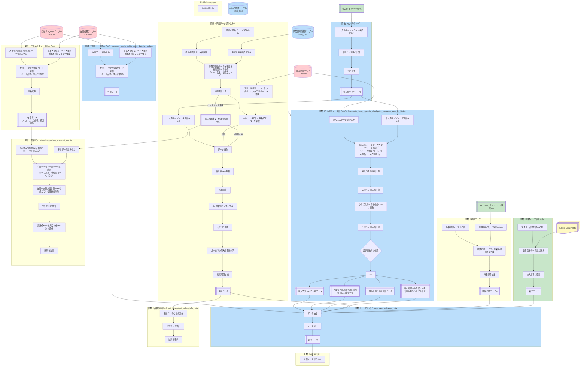

#MermaidEditorをクリックする

```mermaid
flowchart TD
 subgraph s1["関数（在庫データ読み込み）：compute_hourly_buhin_zaiko_data_by_hinban"]
        n10["在庫データ読み込み"]
        n4["品番・整備室コード・拠点所番地対応マスター作成"]
        n13["在庫データと整備室コード統合<br>（キー：品番、拠点所番地）"]
        n19["在庫データ<br>"]
  end
 subgraph s2["関数（かんばんデータ読み込み）：compute_hourly_specific_checkpoint_kanbansu_data_by_hinban"]
        n16["かんばんデータ読み込み"]
        n46["選択変数毎の処理"]
        n47["○○"]
        n48["かんばんデータと仕入先ダイヤデータの統合<br>（キー：整備室コード、仕入先名、仕入先工場名）"]
        n49["仕入先ダイヤデータの読み込み"]
        n50["納入予定日時の計算"]
        n51["入庫予定日時の計算"]
        n52["かんばんデータを仮想FIFOに変換"]
        n53["出庫予定日時の計算"]
        n21["納入予定かんばん数データ"]
        n22["西尾東～部品置き場の滞留かんばん数データ"]
        n23["期待在庫かんばん数データ"]
        n24["順立装置内の滞留と前倒し出庫の差分かんばん数データ"]
  end
 subgraph s3["関数（手配データ読み込み）"]
        n29["手配必要数データの読み込み"]
        n30["手配必要数データ縦展開"]
        n32["手配運用情報読み込み"]
        n31["手配必要数データと手配運用情報データ統合<br>（キー：品番、整備室コード）"]
        n33["必要変数計算"]
        n34["工場・整備室コード・仕入先名・仕入先工場名マスター作成"]
        n36["手配データと仕入先名マスターを統合"]
        n35["仕入先ダイヤデータの読み込み"]
        n37["データ統合"]
        n38["設計値MAX更新"]
        n39["品番抽出"]
        n40["1時間単位にリサンプル"]
        n41["2交代制考慮"]
        n42["月末までの最大日量を計算"]
        n43["指定期間抽出"]
        n44["手配データ"]
        n81["手配必要数＆手配運用情報テーブル"]
  end
 subgraph s4["関数（データ統合）：preprocess.py/merge_data"]
        n45["データ抽出"]
        n58["データ統合"]
        n60["統合データ"]
  end
 subgraph s5["関数（仕入先ダイヤ）"]
        n54["仕入先ダイヤエクセルを読み込む"]
        n56["不等ピッチ等の計算"]
        n55["列名変更"]
        n57["仕入先ダイヤデータ"]
  end
 subgraph s6["関数（特徴量計算）"]
        n59["統合データ読み込み"]
  end
 subgraph s7["関数（稼働フラグ）"]
        n61["基本稼働テーブル作成<br>"]
        n62["残業CSVファイル読み込み"]
        n64["特定日時抽出"]
        n65["稼働日時テーブル"]
        n66["稼働時間テーブル_残業時間考慮済作成"]
  end
 subgraph s10["関数（生物データ読み込み）"]
        n69["マスター品番を読み込む"]
        n70["生産指示データ読み込み"]
        n71["社内品番に変更"]
        n72["着工データ"]
  end
 subgraph s11["関数（在庫全品番データ読み込み）"]
        n75["ある特定期間の全品番のデータ読み込み"]
        n76["品番・整備室コード・拠点所番地対応マスター作成"]
        n77["在庫データと整備室コード統合<br>（キー：品番、拠点所番地）"]
        n78["列名変更"]
        n79["在庫データ<br>（スコープ、全品番、特定期間）"]
  end
 subgraph s12["関数（異常判定）visualize.py/show_abnormal_results"]
        n82["ある特定期間の全品番の在庫データを読み込み"]
        n83["手配データ読み込み"]
        n84["在庫データと手配データの統合<br>（キー：品番、整備室コード、日付）"]
        n85["在庫中央値が設計値MAXを超えている品番は削除"]
        n86["特定の日時抽出"]
        n88["結果を描画"]
        n89["設計値MAX越え設計値MIN割れ評価"]
  end
 subgraph s13["関数（品番情報表示）get_data.py/get_hinban_info_detail"]
        n90["手配データの読み込み"]
        n91["必要カラム抽出"]
        n92["結果を表示"]
  end
 subgraph s14["Untitled subgraph"]
        n93["Untitled Node"]
  end
    n9["自動ラックQRテーブル<br>（Dr.sum）"] --> n10 & n75
    n8["在庫推移テーブル<br>（Dr.sum）"] --> n4 & n76
    n10 --> n13
    n4 --> n13
    n15["所在管理テーブル<br>（Dr.sum）"] --> n16 & n34
    n16 --> n48
    n13 --> n19
    n26["仕入先ダイヤエクセル"] --> n54
    n27["手配必要数テーブル<br>（IBM_DB）"] --> n29
    n29 --> n30
    n28["手配運用情報テーブル<br>（IBM_DB）"] --> n32
    n30 --> n31
    n32 --> n31
    n31 --> n33
    n33 --> n36
    n33 -- バックアップ作成 --> n81
    n34 --> n36
    n35 --> n37
    n36 -- 初回 --> n37
    n37 --> n38
    n38 --> n39
    n39 --> n40
    n40 --> n41
    n41 --> n42
    n42 --> n43
    n43 --> n44
    n19 --> n45
    n21 --> n45
    n22 --> n45
    n23 --> n45
    n24 --> n45
    n44 --> n45 & n90
    n46 --> n47
    n49 --> n48
    n48 --> n50
    n50 --> n51
    n51 --> n52
    n52 --> n53
    n53 --> n46
    n47 --> n24 & n23 & n22 & n21
    n54 --> n56
    n56 --> n55
    n55 --> n57
    n57 --> n49 & n35
    n45 --> n58
    n58 --> n60
    n60 --> n59
    n61 --> n66
    n63["YYYYMM_ラインコード残業.csv"] --> n62
    n62 --> n66
    n64 --> n65
    n66 --> n64
    n65 --> n45
    n69 --> n70
    n70 --> n71
    n71 --> n72
    n72 --> n45
    n74["Multiple Documents"] --> n70
    n75 --> n77
    n76 --> n77
    n77 --> n78
    n78 --> n79
    n81 -- 2回目以降 --> n37
    n79 --> n82
    n81 --> n83
    n82 --> n84
    n83 --> n84
    n84 --> n85
    n85 --> n86
    n86 --> n89
    s3 --> s2
    n89 --> n88
    n90 --> n91
    n91 --> n92
    n10@{ shape: rect}
    n13@{ shape: rect}
    n19@{ shape: internal-storage}
    n46@{ shape: diam}
    n47@{ shape: rect}
    n49@{ shape: rect}
    n50@{ shape: rect}
    n51@{ shape: rect}
    n52@{ shape: rect}
    n53@{ shape: rect}
    n21@{ shape: internal-storage}
    n22@{ shape: internal-storage}
    n23@{ shape: internal-storage}
    n24@{ shape: internal-storage}
    n30@{ shape: rect}
    n32@{ shape: rect}
    n33@{ shape: rect}
    n34@{ shape: rect}
    n36@{ shape: rect}
    n37@{ shape: rect}
    n38@{ shape: rect}
    n39@{ shape: rect}
    n40@{ shape: rect}
    n41@{ shape: rect}
    n42@{ shape: rect}
    n43@{ shape: rect}
    n44@{ shape: internal-storage}
    n81@{ shape: internal-storage}
    n58@{ shape: rect}
    n60@{ shape: internal-storage}
    n56@{ shape: rect}
    n57@{ shape: internal-storage}
    n62@{ shape: rect}
    n64@{ shape: rect}
    n65@{ shape: internal-storage}
    n66@{ shape: rect}
    n69@{ shape: rect}
    n70@{ shape: rect}
    n71@{ shape: rect}
    n72@{ shape: internal-storage}
    n76@{ shape: rect}
    n77@{ shape: rect}
    n78@{ shape: rect}
    n79@{ shape: internal-storage}
    n83@{ shape: rect}
    n84@{ shape: rect}
    n86@{ shape: rect}
    n88@{ shape: rect}
    n91@{ shape: rect}
    n92@{ shape: rect}
    n9@{ shape: cyl}
    n8@{ shape: cyl}
    n15@{ shape: cyl}
    n26@{ shape: internal-storage}
    n27@{ shape: db}
    n28@{ shape: db}
    n63@{ shape: internal-storage}
    n74@{ shape: docs}
    style n9 fill:#FFCDD2
    style n8 fill:#FFCDD2
    style n15 fill:#FFCDD2
    style n26 fill:#C8E6C9
    style n27 fill:#BBDEFB
    style n28 fill:#BBDEFB
    style n63 fill:#C8E6C9
    style n74 fill:#FFF9C4
    style s2 fill:#BBDEFB
    style s5 fill:#BBDEFB
    style s1 fill:#BBDEFB
    style s4 fill:#BBDEFB
    style s10 fill:#C8E6C9
``` 