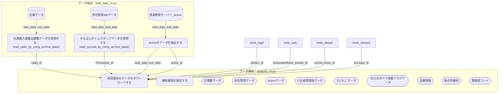

#MermaidEditorをクリックする

```mermaid
flowchart TB
    %%データ抽出
    subgraph read_Data["データ抽出：load_data_v1.py"]
        direction TB
        node_zaiko[("在庫データ")]
        node_zaiko2["在庫数入庫数出庫数データを取得する：read_zaiko_by_using_archive_data()"]
        node_syozai[("所在管理MBデータ")]
        node_syozai2["かんばんタイムスタンプデータを取得する：read_syozailt_by_using_archive_data()"]
        node_active[("資源参照サーバー_Active")]
        node_active2["Activeのデータを抽出する"]
        node_zaiko -- "start_date, end_date" --> node_zaiko2
        node_syozai -- "start_date, end_date" --> node_syozai2
        node_active -- "start_date, end_date" --> node_active2
    end

    %%データ抽出からデータ解析への接続
    node_logi2  -- "teikibin_df" --> node_processeddata
    node_zaiko2  -- "zaiko_df" --> node_processeddata
    node_syozai2  -- "Timestamp_df" --> node_processeddata
    node_active2  -- "start_date, end_date" --> node_processeddata
    node_rack  -- "AutomatedRack_Details_df" --> node_processeddata
    node_active2  -- "active_df" --> node_processeddata
    node_daiya2  -- "arrival_times_df" --> node_processeddata
    node_seisan2  -- "kumitate_df" --> node_processeddata

    %%データ解析
    subgraph analysis_Data["データ解析：analysis_v3.py"]
        direction TB
        node_timerange_for_analysis["解析期間を設定する"]

        node_processeddata["前処理済みデータをダウンロードする"]
        node_zaiko_df(["在庫数データ"])
        node_syozai_df(["所在管理データ"])
        node_active_df(["Activeデータ"])
        node_seisan_df(["IT生産管理版データ"])
        node_teikibin_df(["ろじれこデータ"])
        node_daiya_df(["仕入先ダイヤ到着フラグデータ"])

        node_hinban(["品番情報"])
        node_kyoten(["拠点所番地"])
        node_seibisitu(["整備室コード"])

    end


``` 